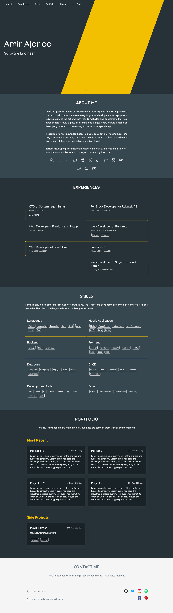
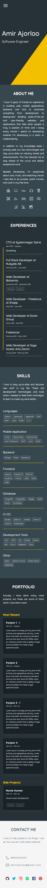

# Personal Website

This is my website's source code and I tried to make it reusable :D

## Change content
To make it dynamic, I use a `data.json` file to put the content on the website. You can simply replace them in your data and/or remove some sections.

## Change colors
All the colors defined in the `static/scss/_variables.scss` and you can change all of them.

## Develop
To be able to use dynamic data (and also generate static HTML file) I need to use jinja to render static HTML file, So I created a simple `Flask` application to serve it in the development mode.

#### Create a virtual envrionment
`$ virtualenv ppython3 venv`
`$ source venv/bin/activate`

#### Install the requirements
`$ pip install -r requirements.txt`

### Install the node dependencies
`$ npm install`

#### Compile SCSS files
`$ grunt`

#### Start the development server
`$ python serve.py`

Now you can open your browser and enter the `http://localhost:4000` to see the website.

## Deploy
To make a static HTML file from your data, you can simply run this command and it moves everything you need to the `dist` folder.
`python build.py`

## Todo
- [ ] Support RTL languages
- [ ] Refactor the data structure

## Screenshot

| Desktop                                | Mobile                                |
| -------------------------------------- | ------------------------------------- |
|  |  |